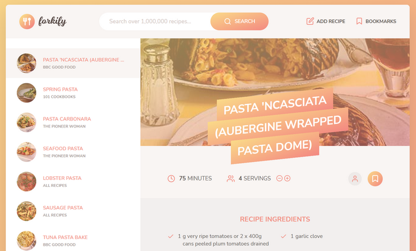

# ES6 Forkify APP

JavaScript recipe search and storage app using tools such as Parcel and Babel with MVC architrcture. This app was written in ES6.

## Table of contents

- [Overview](#overview)
  - [Features](#the-challenge)
  - [Screenshot](#screenshot)
  - [Links](#links)
- [My process](#my-process)
  - [Built with](#built-with)
  - [Continued development](#continued-development)
  - [Continued development](#continued-development)
  - [What I learned](#what-i-learned)
- [Author](#author)

## Overview

### Features

Forkify application main features:

- Search functionality: API search request
- Results with pagination
- Display recipe
- Change servings functionality
- Bookmarking functionality
- Store bookmark data in the browser
- On page load, read saved bookmarks
- Own recipe upload
- Own recipes automatically bookmarked
- User can only see own recipes, not from others

### Screenshot

### Links

Please change your IP, if you are in Iran.

- Live on: [Netlify](https://forkify-parham.netlify.app/)

## My process

### Built with

- ES6
- Node.js
- Local Storage
- Babel
- Parcel
- Core.js
- Regenerator
- [Sass](https://sass-lang.com/) - CSS framework
- [Fraction](https://github.com/infusion/Fraction.js) JS Library
- [Forkify API v2](https://forkify-api.herokuapp.com/v2) Recipe API

### Continued development

Some features and improvments that will be added to the Forkify app in the future:

- Display number of pages between the pagination buttons
- Ability to sort search results by duration or number of ingredients
- Perform ingredient validation in view, before submitting the form
- Improve recipe ingredient input: separate in multiple fields and allow more than 6 ingredients
- Shopping list feature: button on recipe to add ingredients to a list
- Get nutrition data on each ingredient from spoonacularapi (https://spoonacular.com/food-api) and calculate total calories of recipe

### What I learned

This project presented me with ample learning and knowledge of NPM packages, Node.js, and REST/API's! As well as:

- MVC (Model View Controller) architecture, files broken down to enable controller to communicate with view & model. Listening for data, and calling it so it can flow between pieces of the app (Publisher subscriber)

## Author

- Linkedin - [@parham-tavakolian](https://www.linkedin.com/in/parham-tavakolian/)
